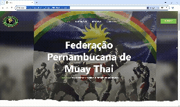

🌐 Site Oficial da Federação Pernambucana de Muay Thai (FPEMT)
Este repositório contém o código-fonte do site oficial da Federação Pernambucana de Muay Thai – www.fpemt.com.br.

O site foi desenvolvido no formato One Page (página única), com navegação fluida e seções bem definidas, oferecendo uma experiência simples, direta e responsiva para todos os usuários.

Seu principal objetivo é divulgar informações institucionais, eventos, filiações, regulamentações e promover o crescimento do Muay Thai no estado de Pernambuco.

